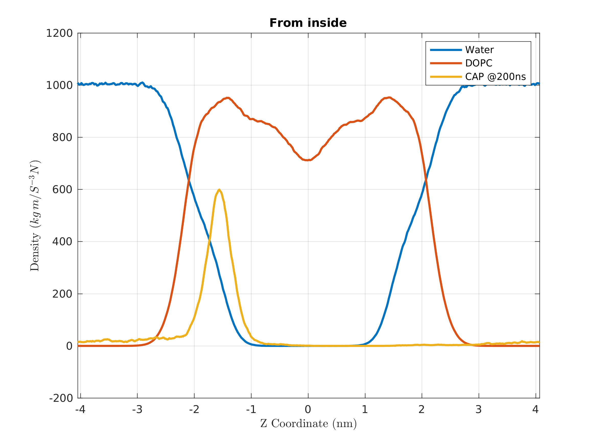

# MD
MD simulations of lipid bilayers and photosensible molecules

Here I will try to put info of the status plot showing next:

# Procedure to obtain the CHARMM files
## Ligand
1. First we start the Ligand Reader & Modeler using the .mol2 file of the molecule.
2. Select Make CGenFF topology, change the name and un-select Guess order
3. Download the compressed file with the results, and check in the topology file LIG.rtf that the penalties are lower than 50.
## Bilayer
  * Open PBD made by the ligand reader/modeler (ligandrm.pdb)
  * Use the original mol2 file(.rtf and .prm file in the residue folder: sometimes does not work)
### Step1: 
  * Check the structure
  * Align principal direction
  * Translate 50 A or 0 depending on out ir in the bilayer.
### Step 2: Lipid components
  * Hidration number 50
  * Number of lipid components: 64 DOPC per leaflet
  * Show the system info button
### Step 3: 
  * Change to NaCl and delete KCl. Calculate solvetn composition

Next until 
### Step 5
  * GROMACS, NPT, 300K (Change)

# Minimization
In the case that there is a problem during minimization using a single precision of GROMACS, please try to use a double precision of GROMACS only for the minimization step.

`$ gmx grompp -f step6.0_minimization.mdp -o step6.0_minimization.tpr -c step5_input.gro -r step5_input.gro -p topol.top -n index.ndx`

`$ gmx mdrun -v -deffnm step6.0_minimization`

# Equilibration
`$ gmx grompp -f step6.1_equilibration.mdp -o step6.1_equilibration.tpr -c step6.0_minimization.gro -r step5_input.gro -p topol.top -n index.ndx`

`$ gmx mdrun -v -deffnm step6.1_equilibration`

`$ gmx grompp -f step6.2_equilibration.mdp -o step6.2_equilibration.tpr -c step6.1_equilibration.gro -r step5_input.gro -p topol.top -n index.ndx`

`$ gmx mdrun -v -deffnm step6.2_equilibration`

`$ gmx grompp -f step6.3_equilibration.mdp -o step6.3_equilibration.tpr -c step6.2_equilibration.gro -r step5_input.gro -p topol.top -n index.ndx`

`$ gmx mdrun -v -deffnm step6.3_equilibration`

`$ gmx grompp -f step6.4_equilibration.mdp -o step6.4_equilibration.tpr -c step6.3_equilibration.gro -r step5_input.gro -p topol.top -n index.ndx`

`$ gmx mdrun -v -deffnm step6.4_equilibration`

`$ gmx grompp -f step6.5_equilibration.mdp -o step6.5_equilibration.tpr -c step6.4_equilibration.gro -r step5_input.gro -p topol.top -n index.ndx`

`$ gmx mdrun -v -deffnm step6.5_equilibration`

`$ gmx grompp -f step6.6_equilibration.mdp -o step6.6_equilibration.tpr -c step6.5_equilibration.gro -r step5_input.gro -p topol.top -n index.ndx`

`$ gmx mdrun -v -deffnm step6.6_equilibration`

# Production
Before doing grompp, remember to change `nsteps                  = 100000000`, to set max time to 200ns.

`$ gmx grompp -f step7_production.mdp -o step7_production.tpr -c step6.6_equilibration.gro -p topol.top -n index.ndx`

 `$ gmx mdrun -v -deffnm step7_production -cpnum -ntmpi 1 -ntomp 16 -nsteps -1 -maxh 48 -cpt 60 -s step7_production.tpr`
 
 `$ gmx mdrun -v -deffnm step7_production -cpnum -ntmpi 1 -ntomp 16 -nsteps -1 -maxh 48 -cpt 60 -s step7_production.tpr -cpi step7_production_stepXXX.cpt`
 
 TO run in OS-Carraixet
`gmx mdrun -v -deffnm step7_production -cpnum -nsteps -1 -maxh 48 -cpt 60 -s step7_production.tpr -cpi step7_production_stepXXX.cpt` 

For execution up to 200ns.
`gmx mdrun -v -deffnm step7_production -cpnum -cpt 60 -s step7_production.tpr -cpi step7_production_stepXXX.cpt
# Density
 
 gmx density -s step7_production.tpr -f step7_production.trr -o density_OOPte_out_200ns.xvg -d Z -sl 500 -b 0 -e 20000000 -xvg none -ng 3
 And then the order is, Water, DOPC and molecule
 
# Trajectory
 gmx trjconv -f step7.trr -s step7.tpr -o Ptr_out_100_200ns.pdb  -b 100000 -e 200000 -skip 10000
 
  gmx trjconv -f step7_inf.trr -s step7_new150ns.tpr -n index.ndx -o Memb_out_18000ps.pdb  -dump 18000
  
  gmx trjconv -f step7_inf.trr -s step7_new150ns.tpr -n index.ndx -o Odecyl_end_200_Ptr_out.pdb  -b 190000 -e 200000
  
# Change Production configuration 
  gmx grompp -f step7_production.mdp -c step7_new.tpr -o step7_new150ns.tpr -p topol.top -n index.ndx
  
# Upload xvg data to repo
cp density_OCAP_in_200ns.xvg ../MD/script/last.xvg
cd  ../MD/script/
nano last_data.dat
git pull
git add .
git commit -m 'OCAP 200ns in'
git push origin
